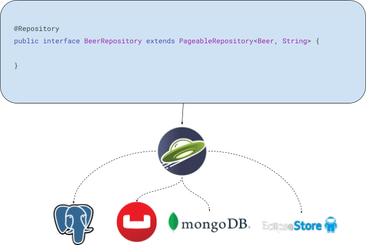

= Jakarta Data sample applications
:toc: auto

This project demonstrates the power of Jakarta Data in creating three applications using the same model but with three different databases. Jakarta Data simplifies data integration and persistence, allowing seamless database interactions. The applications in this project showcase the usage of Jakarta Data with three types of databases:

== Getting Started
To get started with the project, follow these steps:

* Clone the repository to your local machine using the following command:

[source,shell]
----
git clone git@github.com:ultimate-engineer/jakarta-data-2023.git
----

* Ensure you have the necessary dependencies installed for each database:

** *Relational Database with Postgresql*: Install Postgresql and create a database for the application.
** *NoSQL Databases with Couchbase and MongoDB*: Install Couchbase and MongoDB, and create the necessary buckets/collections.
** *Eclipse Store Project*: No additional installations are required.

* Open the project in your preferred IDE.

== Project Structure
The project contains three applications, each located in separate directories:

* link:jakarta-persistence[jakarta-persistence]: Application using a relational database with Postgresql.
* link:document-nosql[document-nosql]: Application using a NoSQL database with Couchbase and MongoDB.
* link:eclipse-store[eclipse-store]: Application using Eclipse Store.

== Contributing

This project is open-source, and contributions are welcome. If you find any issues or want to add enhancements, feel free to open a pull request.

== Resources

For more information about Jakarta Data, you can refer to the official GitHub repository: https://github.com/jakartaee/data